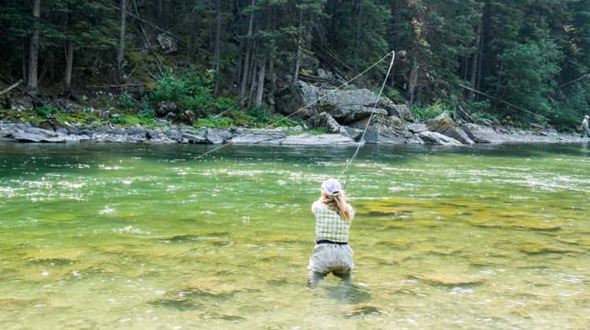
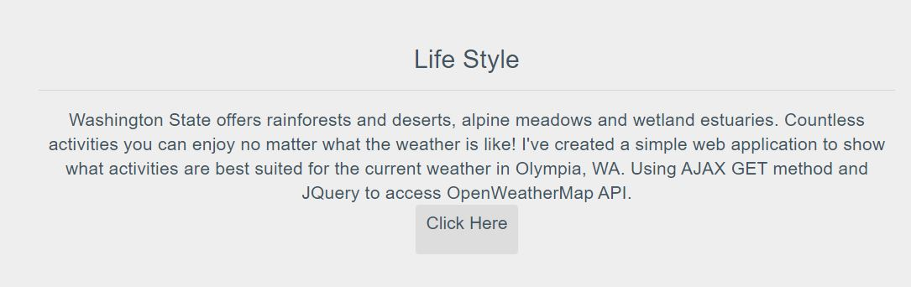
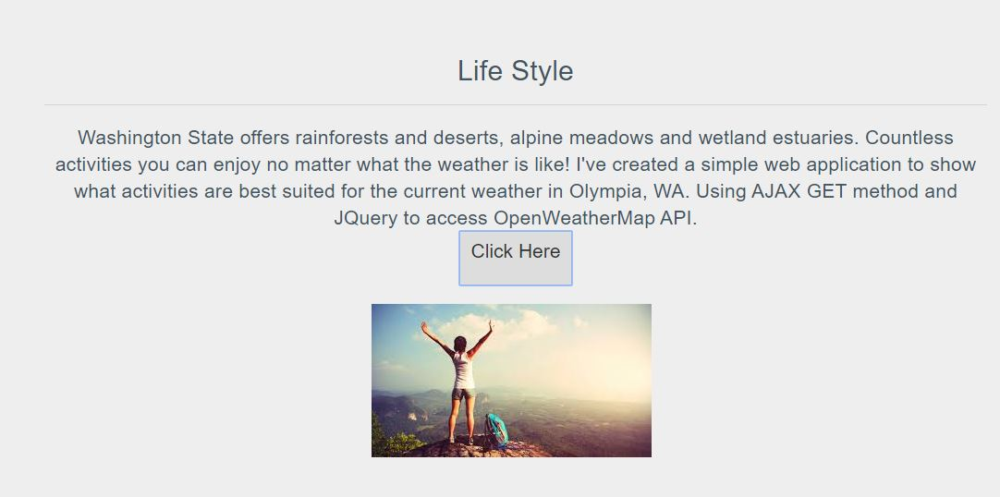

# Local Weather App

This is a Weather App that provides weather conditions and spits out an image of activities that are suitable for Olympia, WA.


##Objective
Display jQuery AJAX methods used to perform an AJAX (asynchronous HTTP) request.

## Installation

Clone the repository and change directories.

```bash
$ git https://github.com/jloh8/WebApp-JQuery-AJAX.git
$ cd local-weather-app
```

No build environment is necessary. This can be run from the file system but ideally it should be run from any local http server.


## Usage

The main functionality is located in the following files.

- index.html - markup
- js/script.js - behavior
- css/style.css - presentation

Including an image folder that holds all custom images to be display in <div> element under different weather conditions.

## Setting up
-Sign up for a free Open Weather Map account.
-Open Postman to check out the data you're working with & to verify that your key works. Make a GET request to the following URL in postman, adding your API key to the end.
````Javascript
http://api.openweathermap.org/data/2.5/weather?q=[ZIP CODE GOES HERE],us?units=imperial&appid=[PUT YOUR API KEY HERE]
````
## Walk-through

1. **Event listener**
  - Target id 'submitCity'
  - The on() method attaches one or more event handlers for the selected elements.
````Javascript
$('#submitCity').on('focus', function(){
````
2. **$.ajax() method**
Passing an object literal to the ajax method.
  - Type: This is type of HTTP request that you want to perform. In this example, I am sending a GET request.
  - url: This is the URL that we want to send an Ajax request to.
  - DataType: We have specified data option as a JSONP object containing data which will be submitted to the server.
  - Success: This is the function that gets called if the request has been successful.
      Note that this function has a parameter called data, which will contain the output from url. In this case, parameter is defined outside of script.

````Javascript
    $.ajax({
    url:"https://api.openweathermap.org/data/2.5/forecast?q=" + 'olympia' + "&units=metric" + "&APPID=7e97ca944b6826492b669fe353f1ba73",
    type: "GET",
    dataType: "jsonp",
    success: function(data){
      const weather = show(data);
      $('#forecast').html(weather);
      }
    });
});
````

3. **show(data) function**

  - Conditional statements that dictates which image pops up according to local weather.

````Javascript
function show(data){
  const x = data.list[1].weather[0].main;

  if (x == 'Clouds'){
    $('#forecast').html("");
    }
  else if(x == 'Clear'){
       $('#forecast').html("");
       }
  else if(x == 'Rain'){
       $('#forecast').html("");
        }
 else if (x == 'Snow'){
            $('#forecast').html("");
            }else{
                $("#error").html('Field cannot be empty');
              }
};
````
>### Illustration (before)


>### Illustration (after)

